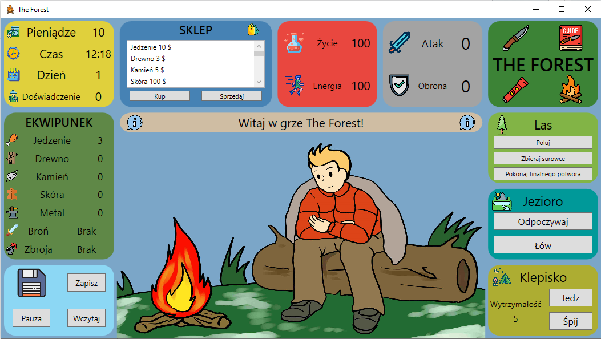

# Instrukcja do gry The Forest #
Gra The Forest to prosta gra symulująca życie rozbitka, który w celu przetrwania musi wykonywać różne czynności. Celem gry jest pokonanie finałowego potwora. Aby być do tego zdolnym, należy zdobyć odpowiedni ekwipunek - broń i zbroję oraz schronienie.
## Interfejs

### Komunikaty
W centralnej części ekranu znajduje się pole z komunikatami tekstowymi. Znajdują się w nim opisy wszystkich wykonywanych na bieżąco akcji.
### Ekwipunek
W lewej części ekranu znajduje się ekwipunek gracza. Składają się na niego jedzenie oraz 4 podstawowe surowce: drewno, kamień, skóra i metal. Są one potrzebne do konstruowania przedmiotów, które można zakupić w sklepie. Poniżej znajduję się pole, w którym wyświetlona jest aktualnie posiadana broń i zbroja.
### Statystyki
Powyżej ekwipunku na żółtym polu znajdują się statystyki gracza. Pokazana jest ilość posiadanych pieniędzy, aktualna godzina, dzień gry oraz punkty doświadczenia. Czas gry jest czasem wirtualnym i jest on przyspieszony 200 razy.
### Zapis gry i pauzowanie
Poniżej ekwipunku znajduje pole, w którym możemy zapisać lub wczytać zapis gry. Jest też przycisk pauza, który umożliwia zapauzowanie oraz wznowienie gry. Wówczas zostanie wstrzymany czas i wszystkie aktywności zostaną zablokowane.
### Sklep
W górnej części ekranu znajduje się sklep. Wybierając odpowiednią rzecz z listy, możemy ją kupić lub sprzedać. Należy jednak zwrócić uwagę, żeby mieć odpowiednią ilość pieniędzy i surowców. Informacja o tym znajduje się tuż obok nazwy produktu. Oprócz tego przy broniach zbrojach i schronieniach znajdują się ich odpowiednio atak, obrona i wytrzymałość.
### Życie i energia
Na górze pośrodku znajduje się pole z informacją o punktach energii i życia. Należy zwracać szczególną uwagę na punkty życia, ponieważ gdy osiągniemy 0 punktów, gra się zakończy i trzeba będzie zacząć grać od nowa.
### Obrona i atak
Na prawo od życia i energii znajduje się wskaźnik punktów ataku i obrony. Mają one wpływ na łupy z polowania lub zbierania surowców.
### Las
W prawej części ekranu znajdują się przyciski, które umożliwiają interakcje  z lasem. 
Możemy udać się na polowanie, gdzie zdobędziemy jedzenie. Wówczas jednak stracimy kilka punktów energii i życia - zależnie od tego, z jaką bronią i zbroją się wybierzemy.
Oprócz tego możemy zbierać surowce. Wtedy tracimy tylko energię.
Możemy również spróbować zawalczyć z finałowym potworem, aby ukończyć grę.
### Jezioro
Jezioro to miejsce rekreacji, możemy tutaj odpocząć i naładować punkty energii albo udać się na wędkowanie i zyskać jedzenie.
### Schronienie
W schronieniu można zjeść jedzenie albo udać się spać. Warto dbać o rozbudowanie schronienia, aby być przygotowanym na niespodziewany atak nocnych potworów.
## Początek gry
Na start gracz posiada 3 sztuki jedzenia i 10 monet. Jest w pełni wypoczęty i ma 100 punktów życia.
## Mechanika gry
### Doświadczenie
W czasie gry warto dbać o zróżnicowane aktywności takie jak zbieranie surowców, polowania lub łowienie. Dodają one punkty doświadczenia, co wpływa na efektywność naszych akcji.
### Czas gry
Warto zwrócić uwagę na biegnący czas. Każda aktywność w grze zajmuje pewien czas. Warto zerkać na zegar w porach wieczornych i wykorzystać noc do spania.
### Atak na obozowisko
W czasie nieprzespanej nocy, hałas zdradza potworom naszą lokalizację. Mogą się one pokusić na zaatakowanie naszego obozowiska. Dlatego warto ulepszać nasze schronienie, co zmniejszy szansę na zaatakowanie naszego domostwa.
## Finał gry
W celu ukończenia gry należy rozprawić się z finałowym potworem. Aby tego dokonać, wymagane są najlepsza broń i zbroja oraz najlepsze zbudowane schronienie. Ponadto trzeba mieć maksymalną ilość zdrowia i energii.
